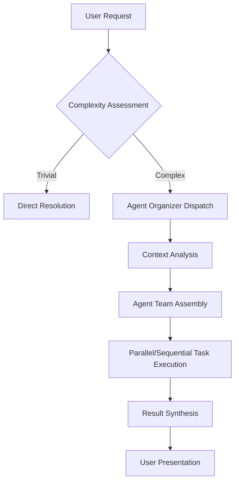

# Claude Code: AI Agent Dispatch Protocol

## Overview

This document defines the communication and coordination protocol for AI agents in complex software development and project management workflows.

## Core Principles

### Purpose
The Claude Code dispatch protocol ensures:
- Structured problem-solving
- Efficient multi-agent coordination
- Targeted expertise application
- Scalable workflow management

## Dispatch Workflow

### Invocation Triggers

Agents **MUST** be invoked when tasks involve:

- Code Generation
- Refactoring
- Debugging
- Complex Analysis
- Feature Implementation
- Test Development
- Documentation Creation
- Strategic Planning

### Communication Flow

### Follow-Up Handling

#### Complexity Categories

1. **Simple Follow-ups**
   - Clarification questions
   - Minor modifications
   - Status updates

2. **Moderate Follow-ups**
   - Domain-specific extensions
   - Iterative improvements
   - Related task completion

3. **Complex Follow-ups**
   - Multi-domain challenges
   - Significant scope changes
   - Expertise reallocation required

## Context Management

### Purpose
Maintain a dynamic, intelligent project knowledge system that:
- Tracks project structure
- Logs agent activities
- Facilitates cross-agent communication
- Enables incremental updates

### Key Components
- Project structure mapping
- Activity logging
- Context distribution
- Knowledge graph maintenance

## Best Practices

- Always delegate complex tasks
- Maintain context consistency
- Preserve incremental work context
- Optimize for token efficiency
- Prioritize structured problem-solving

## Security & Governance

- No autonomous code generation without explicit review
- Maintain strict access controls
- Log all agent interactions
- Implement comprehensive validation

## Extensibility

The protocol is designed to be:
- Technology-agnostic
- Scalable across different project types
- Adaptable to emerging AI collaboration models

---

**Note**: This is a living document. Continuous improvement and adaptation are expected.